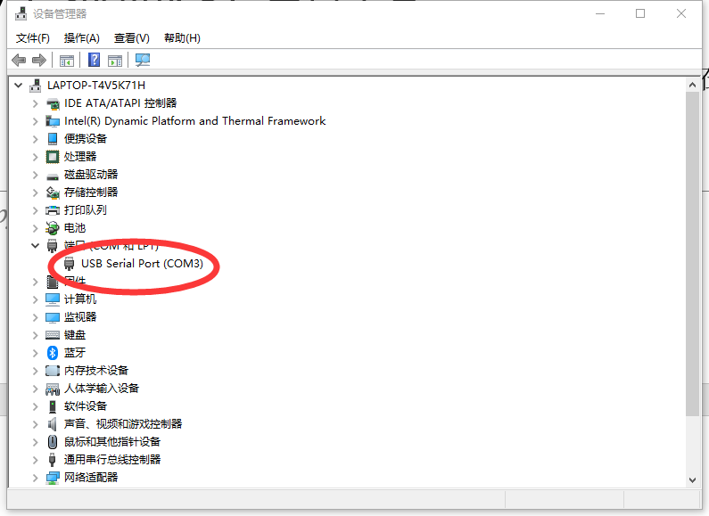

# 系统调试


## 串口调试

### 1. SecureCRT串口工具

   将LKD3399开发板的Debug口连接到PC端的USB口，打开设备管理器获取USB Serial Port的端口号，如下图所示：

   

### 2. Minicom串口工具

1、将LKD3399开发板的Debug口连接到主机端的USB口。

2、以root权限打开minicom： sudo minicom -s。

3、打开Minicom菜单：输入CTRL-A + z。

4、进入Minicom配置界面：输入“O”选择“cOnfigure Minicom”。

5、进入串口设置：选择“Serial port setup”。

6、设置串口设备：输入“A”，写入“/dev/ttyUSB0”，按回车确定。

7、禁止流控：输入“F”，按回车确定。

8、设置波特率：输入“E”，再输入“A”直到显示“Current 1500000 8N1”，然后回车确定。

9、保存设置：选择“Save setup as dfl”。

10、退出设置：选择“Exit”。

## adb调试

### Adb 介绍

`Adb` 是 Android Debug Bridge 的简称，是 Android 的命令行调试工具，可以完成多种功能，如跟踪系统日志、上传下载文件、安装应用等。

### Adb 在 Windows 下的安装

1. 安装 [Rockusb 驱动]。
2. 下载 [adb.zip](http://adbshell.com/upload/adb.zip)，然后解压到 `C:\adb`。

打开 `cmd` 窗口然后运行:

``` shell
C:\adb\adb shell
```

若成功就会进入 adb shell 。

### Adb 在 Ubuntu 下的安装

1. 安装 adb 工具:

    ``` shell
    sudo apt-get install android-tools-adb
    ```

2. 添加设备 ID:

    ``` shell
    mkdir -p ~/.android
    vi ~/.android/adb_usb.ini
    # add the following line:
    0x2207
    ```

3. 为非 root 用户添加 udev 规则：

    ``` shell
    sudo vi /etc/udev/rules.d/51-android.rules
    # add the following line：
    SUBSYSTEM=="usb", ATTR{idVendor}=="2207", MODE="0666"
    ```

4. 重载 udev 规则:

    ``` shell
    sudo udevadm control --reload-rules
    sudo udevadm trigger
    ```

5. 普通用户下重启 adb:

    ``` shell
    sudo adb kill-server
    adb start-server
    ```

然后就可以直接使用 adb 了, 如:

``` shell
adb shell
```

### 常用 Adb 命令

#### 连接管理

列出所有连接设备以及它们的序列号：

``` shell
adb devices
```

若没有多连接设备，就必须用序列号来区分：

``` shell
export ANDROID_SERIAL=<device serial number>
adb shell ls
```

也可以用 TCP/IP 网络连接 Adb ：

``` shell
adb tcpip 5555
```

Adb 会在设备上重启并监听 5555 TCP 端口， 这个时候就可以拔出 USB 线了。

如果设备的 IP 地址为 192.168.1.100，执行以下命令连接:

``` shell
adb connect 192.168.1.100:5555
```

一旦连接，就可以执行 adb 命令了：

``` shell
adb shell ps
adb logcat
```

直到断开 adb 连接：

``` shell
adb disconnect 192.168.1.100:5555
```

#### 调试

##### 查询系统日志

用法:

``` shell
adb logcat [option] [Application label]
```

示例:

``` shell
# 查看所有日志
adb logcat

# 仅查看部分日志
adb logcat -s WifiStateMachine StateMachine
```

#### 收集 Bug 报告

`adb bugreport` 用来收集错误报告和一些系统信息。

``` shell
adb bugreport

# 保存到本地，易于编辑和查看
adb bugreport >bugreport.txt
```

#### 运行 shell

打开一个交互的 shell:

``` shell
adb shell
```

执行 shell 命令:

``` shell
adb shell ps
```

#### Apk 管理

##### 安装 Apk

```text
adb install [option] example.apk

选项:
-l 转发锁定
-r 重新安装应用程序以保留原始数据
-s 安装到SD卡而不是内部存储
```

示例:

``` shell
# 安装 facebook.apk
adb install facebook.apk

# 升级 twitter.apk
adb install -r twitter.apk
```

若安装失败，检查下常见原因:

- `INSTALL_FAILED_ALREADY_EXISTS`: 尝试添加 `-r` 参数再次安装。
- `INSTALL_FAILED_SIGNATURE_ERROR`: APK 签名不一致，这可能是由于签名和调试版本的不同导致的。如果确认APK文件签名是正常的，可以使用 `adb uninstall` 命令卸载旧的应用程序，然后重新安装。
- `INSTALL_FAILED_INSUFFICIENT_STORAGE`: 存储空间不够。

##### 卸载 Apk

``` shell
adb uninstall apk_name
```

示例:

``` shell
adb uninstall com.android.chrome
```

apk 包的名称可以用下面的命令列出:

``` shell
adb shell pm list packages -f
...
package:/system/app/Bluetooth.apk=com.android.bluetooth
...
```
