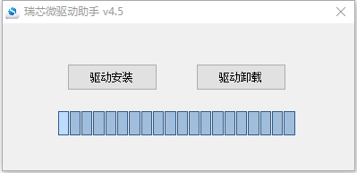

# 固件烧写


## Windows主机烧写固件

1、安装Windows PC端[**USB驱动**](https://www.google.com) (首次烧写执行)

2、双击DriverAssitant_v4.5\ DriverInstall.exe打开安装程序，点击“驱动安装”按提示安装驱动即可，安装界面如下所示:

   

3、Type-C线连接主机端的USB接口和LB3399发板的Type-C接口，进入烧写模式。

4、将固件解压到AndroidTool_Release_v2.64\images目录下。

5、双击AndroidTool_Release_v2.64\AndroidTool.exe启动烧写工具，单击 **升级固件**，选择刚解压到AndroidTool_Release_v2.64\images目录下的固件。如下所示：

   

6、长按LB3399发板上recovery按键后重启机器，直到系统进入Loader模式，如下所示：

   

7、单击 **XXX** 执行烧写


## Linux主机烧写固件

1、安装Linux烧写工具 [**upgrade_tool**](https://www.google.com)

2、Type-C线连接主机端的USB接口和LB3399开发板的Type-C接口。

3、长按LB3399开发板上recovery按键后重启机器，进入Loader模式。

4、将固件解压到linuxTool-v1.0/images目录下。

5、执行如下命令烧写固件：

   ``` sh
   sudo upgrade_tool uf update.img
   ``` 
